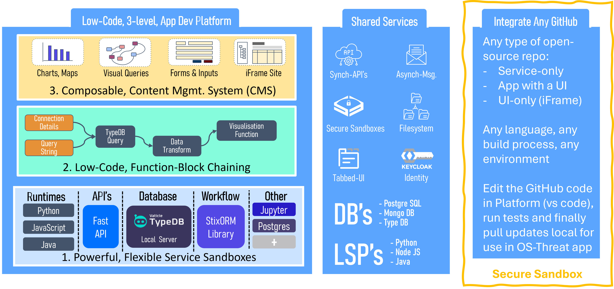
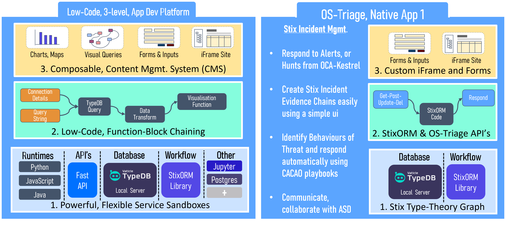
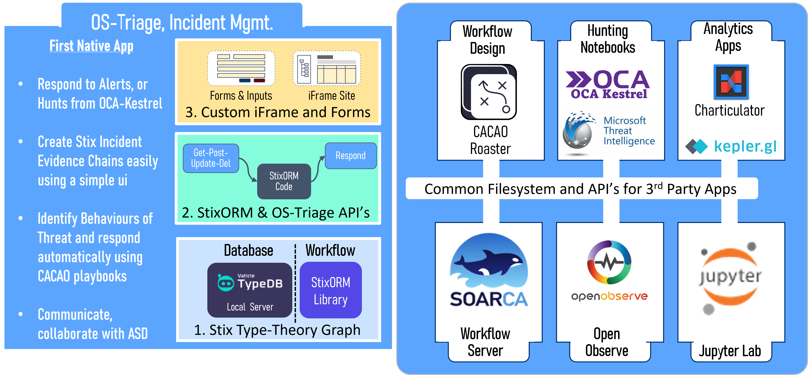
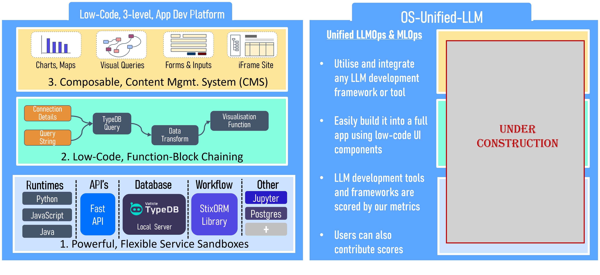

# 1 OS-Threat Overview

## 1.1 OS-Threat is a Low-Code Development Platform

OS-Threat is a low code, development platform comprised of tools at 3 different levels:
1. Powerful, Flexible Service Sandboxes: Services of any type can be easily loaded and accessed by API's, for example databases
2. Low-Code, Function Block Chaining: Super flexible way of combining scripts in JS, Python or Java, into chained, asynchronous blocks
3. Composable Content Management System: Drag and drop page composition system including a full set of charting and mapping widgets, plus standard Bootstrap components e.g. accordions, buttons, tables etc.

As a consequence, the OS-Threat app exposes a set of common services to any app or service in the platform including:
- internal API network for synchronous requests
- internal messaging system for asynchronous requests
- secure sandboxes, supporting any environment or language
- shared filesystem
- tabbed user interface
- keycloak identity capabilities
- shared databases and language servers

The OS-Threat app is able to load any GitHub repo into a Secure Sandbox, and run it on demand. If it is a service-only (i.e. no ui), then a Gradio user interface can be provided. If it contains its own ui, then that can be provided with its own tab, so it is easily accessible for the user.

These concepts can be seen in the diagram below

## 1.2 OS-Triage is the First Native App

OS-Triage is the world's first Stix-based Incident Management System. It includes the following objects:
- [Stix v2.1 objects](https://oasis-open.github.io/cti-documentation/stix/intro)
- [Mitre ATT&CK objects](https://attack.mitre.org/)
- Stix Extensions: [Incident](https://github.com/os-threat/cti-stix-common-objects/blob/main/extension-definition-specifications/incident-core/Incident%20Extension%20Suite.adoc), [Identity](https://github.com/os-threat/cti-stix-common-objects/blob/main/extension-definition-specifications/identity-contact-information/Identity%20Contact%20Information.docx)
- [ OCA Indicators of Behavior (IoB)](https://opencybersecurityalliance.org/introducing-the-indicators-of-behavior-iob-sub-project/) objects
- [OCA Kestrel Hunting ](https://opencybersecurityalliance.org/kestrel-data-retrieval-explained/)objects

By being the first to unify all of these Stix dialects, with our low-code platform, and a series of custom iFrame user interface widgets, OS-Threat makes it easy to use user interface for Incident Management. It provides you with the world's first, 100% standard, Incident Management System. 

You can send these reports to your government cyber security agency, and they will be able to import and run it. Anyone with a Stix gateway can consume an OS Threat Incident report.

Further, we provide you with a means to capture Impacts, Tasks and Key Events in the Incident. Integrating with the OCA Kestrel Hunting System, means that users can hunt for artefacts through 35 different alert systems.

Exposing the novel, [CISA-backed OCA Indicators of Behavior objects](https://opencybersecurityalliance.org/iob/), means that finally threat hunters can link ***"Detections"*** from ***"Detectors"***, to identify threatening ***"Behaviors"***, and fire off automated response ***"Playbooks"*** (CACAO).

Finally, making all of this available in a simple, icon-driven user interface, with powerful, extensible Stix Form behaviour, makes it all easy to use for the cybersecurity professional.

## 1.3 On Launch, OS-Triage Will Include >7 Other Apps

Incident Management is useful by itself, but its utility is magnified many times by integrating it with:

- [CACAO Roaster](https://opencybersecurityalliance.org/cacao-roaster/) - An Existing CACAO Workflow designer
- [CACAO SOARCA](https://github.com/COSSAS/SOARCA) - An existing CACAO server, including Open-C2 command language
- [Jupyter Lab](https://jupyter.org/install) - An open source Python Notebook Interface
- OCA Kestrel Hunting - [Hunt through 35 different systems](https://stix-shifter.readthedocs.io/en/latest/CONNECTORS.html)
- Open Observe - Connect to your company's alerting system
- plus others

The main benefit of this is to create a cohesive, powerful tool that is easy to customise and extend.

## 1.4 OS-Unified-LLM will be the Second Native App

OS-Unified LLM will be unique as it is the only toolset to embrace all open source LLM and ML app frameworks and methods, enabling you to pick and choose which libraries you want installed, and which models running on local or remote resources (e.g. Ollama). 

OS-Unified-LLM has a scoring system against which it scores open-source app frameworks. Our focus is specifically on the efficacy of the app framework, the middle layer, rather than the underling model.

OS-Unified-LLM will develop easily discoverable toolsets, such as configurable memory, multiple types of RAG systems, model debugging and tracing. Usders can also install their own choices of open-source tools, and still address these common resources through MCP (Model Context Protocol).

OS-Unified-LLM will be used extensively in combination with OS-Triage, on cybersecurity tasks, however it can also be used on its own, without the need for any cybersecurity. OS-Unified-LLM is a powerful platform for your next open source project.

OS-UNified-LLM may develop user interfaces for particular libraries, depending on user demand. 

The ability of the OS-Threat app to be extended or customised by the user is enormous.

