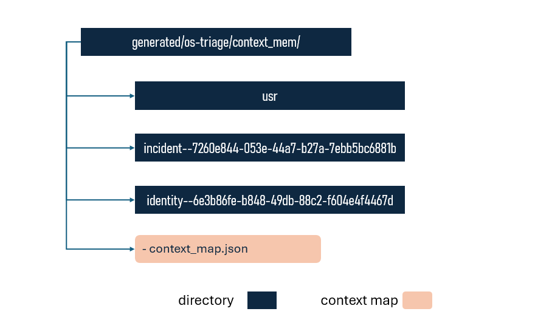
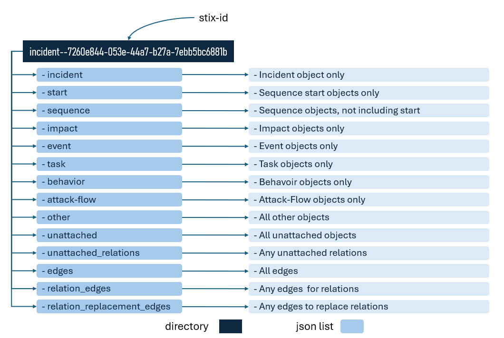
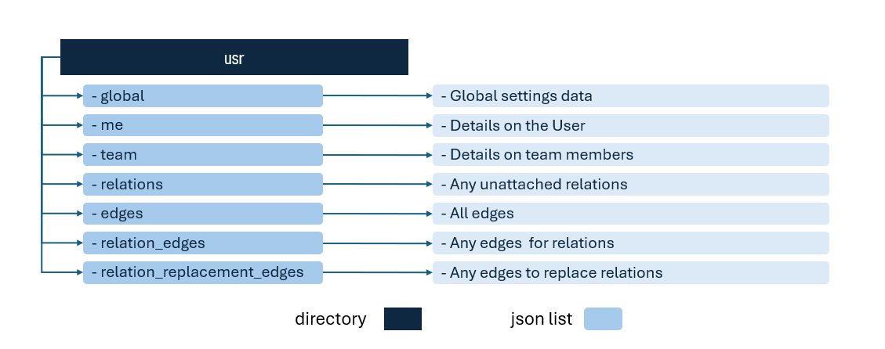

# API Middleware and Context Memory

There are three types of APi's:

1. **Context Memory APIs:** API's to create, save and get objects from one of the context memory types
2. **Viz-Data APIs:** API's to provide data for the viz events
3. **StixORM APIs:** API's to convert forms into Stix JSON objects

Some understanding of the context memory system is required to understand how the prototype works

## 3.1 Context Memory API's

### 3.1.1: Context Storage Philosphy

Every stix object is stored in full force graph form, so:

- **Wrapper:** The raw Stix object is surrounded by a wrapper, which contains data for the icon name, the form name, tooltip heading and body, with the raw object stored in the wrapper, under the field name *"original"*
- **Edges:** All possible edges must be pre-calculated and stored, even if the matching node is not present. The correct edges for any sub-graph can always be drawn from this pool
- **SRO Relations** Technically, a force graph only shows nodes or edges, whereas an SRO is a binary relationship. Thus, the SRO cn be displayed either as an SRO node with two directted edges, or collapsed into a single, directed egde. Thus SRO's are stored in there own list, as are their edges and replacement edges,.
- **Many Small Lists, Rather than One Large List:** A decision taken early on to speed file access and minimise corruption possibility, by atomising the lists as much as possible
- **An Unattached Memory for Concepts and Edges Before they are Promoted Into the Incident:** This is important as it enforces a rigour into the process of creating an Incident. Evidence needs to be wieghed as do the conclusions. One needs to be able to assemble and associate concepts freely, before promotoing them into the Incident. SRO's, their edges and their replacement edges also need their own unattached lists
- **To Have Multiple Incidents and Multiple Company's, We Need a Concept Map** To have multiple Incidents going, or saved in context memory, rather than just each one sequentially, a centralised map is needed, that contains the list of all incidents, and the id of the current incident being worked on. Assuming users may want the freedom to work for one or multiple different company's, then the concept map also needs to hold the list of all companies and the id of the current company being worked on.
- **Act on the Context Memory, then Refresh the Viz from Context to See the Changes:** In the prototype, any time an action is taken on an object to make it appear somewhere else, update it, or delete it. In reality it is happening in the context memory, and hten the viz is being refreshed.

### 3.1.2 Context Memory Layout

All data used in the prototype are contained in context memory files, in three different types of directories:

1. **Incident Context:** Files that contain data about each Incident
2. **Company Context:** Files that contain data about each Company
3. **User Context:** Files that contain data about the user

There is only one context directory for the User (i.e. there can be only one User of the software), whereas there can be multiple Incident and Company Context directories (i.e. there can be multiple Company's, and multiple Incidents). 

This structure is shown below, where the stix id's ae used as the directory names, for each company or incident, and the names are registered in a context map file. The context map file is a json that contains a list of all companies and a list of all incidents, as well as fields with the stix-id's of the current incident and current company.

### 3.1.3: Incident Context

An Incident must be created through a modal Incident form, that triggers the "Create Incident API". This API takes the data from the modal form and creates the incident context directory, and saves the initial record. Objects that are used before being officially promoted are saved in the Unattached context. Thus the apis are as shwon in the following table

| Context Type    | name                                   | trigger                           | purpose                                                        | api_type | api_url                                                 | postman link                                                                                                                                                                                        |
|-----------------|----------------------------------------|-----------------------------------|----------------------------------------------------------------|----------|---------------------------------------------------------|-----------------------------------------------------------------------------------------------------------------------------------------------------------------------------------------------------|
| Unattached-Save | Save Object to Current Unattached      | Form Save                         | Used to create all new objects, except Incident, Company, User | POST     | http://localhost:8111/os-triage/unattached-context/save | [Postman Link](https://typerefinery.postman.co/workspace/Typerefinery.ai~b6d2bf33-d8a3-4b45-88b4-50bb72a28759/request/21655574-38efb3ef-e726-4c4e-8430-9dcb00062159?action=share&source=copy-link&creator=21665576) |
| Incident-Create | Create a New Incident Context Memory   | From Modal Incident Create button | Used to create new context memory, and set current index       | POST     | http://localhost:8111/os-triage/incident-context/create | [Postman Link](https://typerefinery.postman.co/workspace/Typerefinery.ai~b6d2bf33-d8a3-4b45-88b4-50bb72a28759/request/21655574-663672d1-151f-44ec-b65e-c45ed3a55733?action=share&source=copy-link&creator=21665576) |
| Incident-Save   | Save to Current Incident               | From Promote Button               | Used to save new objects into the Incident Structure           | POST     | http://localhost:8111/os-triage/incident-context/save   | [Postman Link](https://typerefinery.postman.co/workspace/Typerefinery.ai~b6d2bf33-d8a3-4b45-88b4-50bb72a28759/request/21655574-1315c79d-9f1c-4ade-96ed-73c3cfc66b21?action=share&source=copy-link&creator=21665576) |
| Incident-Get    | Get from Current Incident              |                                   |                                                                | POST     | http://localhost:8111/os-triage/incident-context/get    | [Postman Link](https://typerefinery.postman.co/workspace/Typerefinery.ai~b6d2bf33-d8a3-4b45-88b4-50bb72a28759/request/21655574-4aaf5d92-490b-4c42-9982-c53816269c0f?action=share&source=copy-link&creator=21665576) |

Incidents are a list of objects, and can be seen as a parent object plus extension, that references many other objects, such as observations, observables, tasks, impacts etc. Each list represents either a list field in the extended Incident model, or a category of object needed to make the force graphs flxibile.

However, objects are only promoted into the Incident when they have been carefully examined and promoted. Before concepts have been promoted, they must be stored in the unattached list. 

This idea of an unattached memory, one can have hanging around between sessions, before promotion, is a unique concept to OS-Threat.

### 3.1.3: Company Context

A Company must be created through a modal Company form, that triggers the "Create Company API".  The Company API's can be seen below

| Context Type    | name                                   | trigger                           | purpose                                                        | api_type | api_url                                                 | postman link                                                                                                                                                                                        |
|-----------------|----------------------------------------|-----------------------------------|----------------------------------------------------------------|----------|---------------------------------------------------------|-----------------------------------------------------------------------------------------------------------------------------------------------------------------------------------------------------|
| Company-Create  | Create a New Company Context Memory    | From Modal Create Company form    | Used to Create New Company and Context Memory                  | POST     | http://localhost:8111/os-triage/company-context/create  | [Postman Link](https://typerefinery.postman.co/workspace/Typerefinery.ai~b6d2bf33-d8a3-4b45-88b4-50bb72a28759/request/21655574-7ecc113d-26f5-4b75-b55e-8ee4a8d76ed4?action=share&source=copy-link&creator=21665576) |
| Company-Save    | Save an object to the Current Company  | From Company Interface            | Used to Save an object to the Current Company                  | POST     | http://localhost:8111/os-triage/company-context/save    | [Postman Link](https://typerefinery.postman.co/workspace/Typerefinery.ai~b6d2bf33-d8a3-4b45-88b4-50bb72a28759/request/21655574-e2f71a4b-deed-49f0-bbbc-4d811bcc34e5?action=share&source=copy-link&creator=21665576) |
| Company-Get     | Get an Object from the Current Company |                                   |                                                                | POST     | http://localhost:8111/os-triage/company-context/get     | [Postman Link](https://typerefinery.postman.co/workspace/Typerefinery.ai~b6d2bf33-d8a3-4b45-88b4-50bb72a28759/request/21655574-32c3aa1e-707e-47c5-b40d-ba7136e5876d?action=share&source=copy-link&creator=21665576) |

Attached to a company are:

- users (identity, email-addr, user-account)
- systems (identity, software)
- assets (identity)

Currently, an Identity is used where there is no proper Stix objects and OS-Threat uses custom categories, and different icons (e.g. asset SDO)

### 3.1.4: User Context

The User Context is serviced by two apis, as shown below

| Context Type    | name                                   | trigger                           | purpose                                                        | api_type | api_url                                                 | postman link                                                                                                                                                                                        |
|-----------------|----------------------------------------|-----------------------------------|----------------------------------------------------------------|----------|---------------------------------------------------------|-----------------------------------------------------------------------------------------------------------------------------------------------------------------------------------------------------|
| User-Save       | Save an Object to the User Context     | From User Interface               | Used to save an object into the User context                   | POST     | http://localhost:8111/os-triage/user-context/save       | [Postman Link](https://typerefinery.postman.co/workspace/Typerefinery.ai~b6d2bf33-d8a3-4b45-88b4-50bb72a28759/request/21655574-8f0cb73a-5f7e-4acf-8c20-754240497eff?action=share&source=copy-link&creator=21665576) |
| User-Get        | Get an Object from the User            |                                   |                                                                | POST     | http://localhost:8111/os-triage/user-context/get        | [Postman Link](https://typerefinery.postman.co/workspace/Typerefinery.ai~b6d2bf33-d8a3-4b45-88b4-50bb72a28759/request/21655574-527b895a-9be7-4f4d-aa1f-7ebdccc0dc8f?action=share&source=copy-link&creator=21665576) |

The user details include:

- user identity, email-addr's, and user-account's
- team details, including identity's, email-addr's anduser-account's

## 3.2 Vix-Data API's

There are a series of API's used to access data needed to support all of the viz actions

| Page                | name                               | trigger                                   | message_name              | api_type | api_url                                                                              | postman link                                                                                                                                                                                        |
|---------------------|------------------------------------|-------------------------------------------|---------------------------|----------|--------------------------------------------------------------------------------------|-----------------------------------------------------------------------------------------------------------------------------------------------------------------------------------------------------|
| Detail              | Get Force for Promo Scratch        | Refresh Promo Scratch                     | "Viz-Data-Promo-Scratch"  | GET      | http://localhost:8111/viz-data/unattached-force-graph                                |                                                                                                                                                                                                     |
| Detail              | Get Tree for Company               | Change Radio Button                       | ""Viz-Data-Tree-Company"  | GET      | http://localhost:8111/viz-data/tree-company                                          |                                                                                                                                                                                                     |
| Detail              | Get Tree for Event                 | Change Radio Button                       | ""Viz-Data-Tree-Event"    | GET      | http://localhost:8111/viz-data/tree-event                                            |                                                                                                                                                                                                     |
| Detail              | Get Tree for Impact                | Change Radio Button                       | ""Viz-Data-Tree-Impact"   | GET      | http://localhost:8111/viz-data/tree-impact                                           |                                                                                                                                                                                                     |
| Detail              | Get Tree for Sighting              | Default Radio Button                      | ""Viz-Data-Tree-Sighting" | GET      | http://localhost:8111/viz-data/tree-sighting                                         |                                                                                                                                                                                                     |
| Detail              | Get Tree for Task                  | Change Radio Button                       | ""Viz-Data-Tree-Task"     | GET      | http://localhost:8111/viz-data/tree-task                                             |                                                                                                                                                                                                     |
| Detail              | Get Tree for User                  | Change Radio Button                       | ""Viz-Data-Tree-User"     | GET      | http://localhost:8111/viz-data/tree-user                                             |                                                                                                                                                                                                     |
| Detail-LMB-Select   | Select Icon, Update Form with Data | Select an Icon in the Foirce Graph        | "Update-Form-Open"        | POST     | ?????                                                                                |                                                                                                                                                                                                     |
| Detail-RMB-Tree     | Copy Tree Item to Unattached       | Select tree object, RMB Menu select       |                           | POST     | http://localhost:8111/os-triage/rmb-tree/copy-to-unattached                          | [Postman Link](https://typerefinery.postman.co/workspace/Typerefinery.ai~b6d2bf33-d8a3-4b45-88b4-50bb72a28759/request/21655574-99cc969e-eb1c-4f10-8432-25e885f35dc4?action=share&source=copy-link&creator=21665576) |
| Detail-RMB-Tree     | Edit DAG to Unattached             | Select tree object, RMB Menu select       |                           | POST     | http://localhost:8111/os-triage/rmb-tree/edit-DAG--to-unattached                     | [Postman Link](https://typerefinery.postman.co/workspace/Typerefinery.ai~b6d2bf33-d8a3-4b45-88b4-50bb72a28759/request/21655574-80b504eb-dd2a-4c09-b8f8-f17ba847ac0c?action=share&source=copy-link&creator=21665576) |
| Detail-RMB-Force    | Get SRO for Selected               | Select two force objects, RMB Menu select |                           | POST     | https://flow.typerefinery.localhost:8101/os-triage/rmb-force/get-relationship-types  | [Postman Link](https://typerefinery.postman.co/workspace/Typerefinery.ai~b6d2bf33-d8a3-4b45-88b4-50bb72a28759/request/21655574-36137751-a994-4570-b29e-11f85b82ed3f?action=share&source=copy-link&creator=21665576) |
| Detail-RMB-Force    | Get Foreign Keys for Selected      | Select two force objects, RMB Menu select |                           | POST     | https://flow.typerefinery.localhost:8101/os-triage/rmb-force/get-connection-types    | [Postman Link](https://typerefinery.postman.co/workspace/Typerefinery.ai~b6d2bf33-d8a3-4b45-88b4-50bb72a28759/request/21655574-e7f05209-df18-4be6-ac6a-b98146e2940d?action=share&source=copy-link&creator=21665576) |
| Overview            | Get Default Incident               | Open Overview Page                        | ""Viz-Data-Overview"      | GET      | http://localhost:8111/viz-data/overview-default-incident                             |                                                                                                                                                                                                     |
| Overview-LMB-Select | Select Icon, Update Form with Data | Select an Icon in the Foirce Graph        | "Update-Form-Open"        | POST     | ?????                                                                                |                                                                                                                                                                                                     |
| Table               | Given ID, Get Incident             | Double-click row in table                 | null                      | POST     | http://localhost:8111/viz-data/overview-with-id                                      | [Postman Link](https://typerefinery.postman.co/workspace/Typerefinery.ai~b6d2bf33-d8a3-4b45-88b4-50bb72a28759/request/21655574-dad7fbc2-dca0-469c-b410-34b3bb260bea?action=share&source=copy-link&creator=21665576) |
| Table               | Get All Incidents                  | Open Table page                           | null                      | GET      | http://localhost:8111/viz-data/table-all-incidents                                   |                                                                                                                                                                                                     |
| Form-Data           | Get Enums for Fieldname in url     | Open Form containing this field           | null                      | GET      | https://flow.typerefinery.localhost:8101/stix-orm/utils/enum/activity_condition_enum | [Postman Link](https://typerefinery.postman.co/workspace/Typerefinery.ai~b6d2bf33-d8a3-4b45-88b4-50bb72a28759/request/21655574-695cea68-c9ef-4d5e-bfba-ec31cee0d22c?action=share&source=copy-link&creator=21665576) |
| Form-Data           | Get Vocab for Fieldname in url     | Open Form containing this field           | null                      | GET      | https://flow.typerefinery.localhost:8101/stix-orm/utils/vocab/account-type-ov        | [Postman Link](https://typerefinery.postman.co/workspace/Typerefinery.ai~b6d2bf33-d8a3-4b45-88b4-50bb72a28759/request/21655574-9c0e8677-09d5-478d-abc4-f64f5d6a78a8?action=share&source=copy-link&creator=21665576) |

## 3.3 Stix-ORM API's

For evey Stix objects, there must be a corresponding StixORM api and a form.

| StixType          | name              | purpose                                                    | api_type | api_url                                                                                                                                                                                             | postman link                                                                                                                                                                                        |
|-------------------|-------------------|------------------------------------------------------------|----------|-----------------------------------------------------------------------------------------------------------------------------------------------------------------------------------------------------|-----------------------------------------------------------------------------------------------------------------------------------------------------------------------------------------------------|
| sdo-Event         | Event SDO         | Create Event Object from Form                              | POST     | http://localhost:8111/stix-orm/sdo/event                                                                                                                                                            | [Postman Link](https://typerefinery.postman.co/workspace/Typerefinery.ai~b6d2bf33-d8a3-4b45-88b4-50bb72a28759/request/21655574-d4a6dc3d-03ec-4c23-a60c-98d1bd49bb2e?action=share&source=copy-link&creator=21665576) |
| so-Identity       | Identity SDO      | Create Identity Object from Form                           | POST     | http://localhost:8111/stix-orm/sdo/identity                                                                                                                                                         | [Postman Link](https://typerefinery.postman.co/workspace/Typerefinery.ai~b6d2bf33-d8a3-4b45-88b4-50bb72a28759/request/21655574-2d35cd4e-6db2-466d-9c94-eb3584c0a466?action=share&source=copy-link&creator=21665576) |
| sdo-Impact        | Impact SDO        | Create Impact Object from Form                             | POST     | http://localhost:8111/stix-orm/sdo/impact                                                                                                                                                           |                                                                                                                                                                                                     |
| sdo-Incident      | Incident SDO      | Update Incident Object from Form                           | POST     | http://localhost:8111/stix-orm/sdo/incident                                                                                                                                                         | [Postman Link](https://typerefinery.postman.co/workspace/Typerefinery.ai~b6d2bf33-d8a3-4b45-88b4-50bb72a28759/request/21655574-4fba32cd-8f50-4852-8353-86392df582b9?action=share&source=copy-link&creator=21665576) |
| sdo-Indicator     | Indicator SDO     | Create Indicator Object from Form                          | POST     | http://localhost:8111/stix-orm/sdo/indicator                                                                                                                                                        | [Postman Link](https://typerefinery.postman.co/workspace/Typerefinery.ai~b6d2bf33-d8a3-4b45-88b4-50bb72a28759/request/21655574-89b926e7-bceb-4bda-a575-245488ef1c6f?action=share&source=copy-link&creator=21665576) |
| sdo-Observed-Data | Observed-Data SDO | Create Observed Data object from form and attached objects | POST     | http://localhost:8111/stix-orm/sdo/observed-data                                                                                                                                                    | [Postman Link](https://typerefinery.postman.co/workspace/Typerefinery.ai~b6d2bf33-d8a3-4b45-88b4-50bb72a28759/request/21655574-30b3d62a-9cac-475c-8277-e3e0d845bfe5?action=share&source=copy-link&creator=21665576) |
| sdo-Sequence      | Sequence SDO      | Create Sequence Object from Form                           | POST     | http://localhost:8111/stix-orm/sdo/sequence                                                                                                                                                         | [Postman Link](https://typerefinery.postman.co/workspace/Typerefinery.ai~b6d2bf33-d8a3-4b45-88b4-50bb72a28759/request/21655574-e304748d-7ae0-4a0f-ac17-ee1beb9f8988?action=share&source=copy-link&creator=21665576) |
| sdo-Task          | Task SDO          | Create Task Object from Form                               | POST     | http://localhost:8111/sdo/stix-orm/task                                                                                                                                                             | [Postman Link](https://typerefinery.postman.co/workspace/Typerefinery.ai~b6d2bf33-d8a3-4b45-88b4-50bb72a28759/request/21655574-c79ee2ab-1d6f-45c8-a536-98242ace6fe9?action=share&source=copy-link&creator=21665576) |
| sro-Relationship  | Relationship SRO  | Create Relationship Object from Form                       | POST     | http://localhost:8111/stix-orm/sro/relationship                                                                                                                                                     | [Postman Link](https://typerefinery.postman.co/workspace/Typerefinery.ai~b6d2bf33-d8a3-4b45-88b4-50bb72a28759/request/21655574-67d91663-7764-4ebe-b5d4-644f0f71a265?action=share&source=copy-link&creator=21665576) |
| sro-Sighting      | Sighting SRO      | Create Sighting from Form                                  | POST     | http://localhost:8111/stix-orm/sro/sighting                                                                                                                                                         | [Postman Link](https://typerefinery.postman.co/workspace/Typerefinery.ai~b6d2bf33-d8a3-4b45-88b4-50bb72a28759/request/21655574-3058887c-5e58-484a-adc0-93f28fff2e7a?action=share&source=copy-link&creator=21665576) |
| sco-Anecdote      | Anecdote SCO      | Create Anecdote from Form                                  | POST     | http://localhost:8111/stix-orm/sco/anecdote                                                                                                                                                         | [Postman Link](https://typerefinery.postman.co/workspace/Typerefinery.ai~b6d2bf33-d8a3-4b45-88b4-50bb72a28759/request/21655574-d61add28-f906-4500-92b7-1a5849829ff9?action=share&source=copy-link&creator=21665576) |
| sco-Email-Addr    | Email-Addr SCO    | Create Email-Addr from Form                                | POST     | http://localhost:8111/stix-orm/sco/email-addr                                                                                                                                                       | [Postman Link](https://typerefinery.postman.co/workspace/Typerefinery.ai~b6d2bf33-d8a3-4b45-88b4-50bb72a28759/request/21655574-f62b2cec-faa7-47ed-ba5e-4d18b2627c3e?action=share&source=copy-link&creator=21665576) |
| sco-Email-Message | Email-Message SCO | Create Email-Message from Form                             | POST     | | [Postman Link](https://typerefinery.postman.co/workspace/Typerefinery.ai~b6d2bf33-d8a3-4b45-88b4-50bb72a28759/request/21655574-af7bd43d-91d6-4e14-a531-c8ca5d86f3f9?action=share&source=copy-link&creator=21665576) |
| sco-Url           | Url SCO           | Create Url from Form                                       | POST     | http://localhost:8111/stix-orm/sco/url                                                                                                                                                              | [Postman Link](https://typerefinery.postman.co/workspace/Typerefinery.ai~b6d2bf33-d8a3-4b45-88b4-50bb72a28759/request/21655574-f959c651-0388-4954-a351-6e1b35a54874?action=share&source=copy-link&creator=21665576) |
| sco-User-Account  | User-Account SCO  | Create User-Account from Form                              | POST     | http://localhost:8111/stix-orm/sco/user-account                                                                                                                                                     | [Postman Link](https://typerefinery.postman.co/workspace/Typerefinery.ai~b6d2bf33-d8a3-4b45-88b4-50bb72a28759/request/21655574-a5b1378c-740a-4eeb-8172-5b0b0683ca9f?action=share&source=copy-link&creator=21665576) |