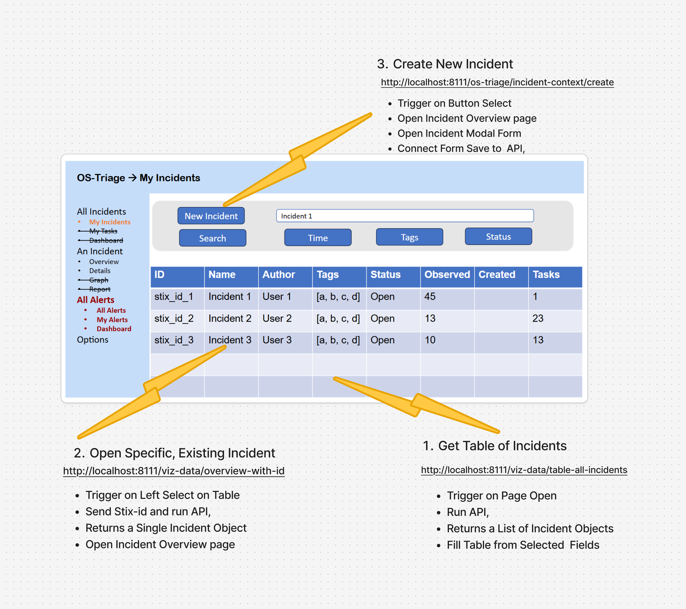

# Page 1: All Incidents Table

This simple page, is assembled by standard OS Threat widgets, including: table, buttons etc.

The prototype includes 3 events, which can go direct from initiator to an api, see image below.

## Event 1: Get Table of Incidents

## Event 2: Open Specific, Existing Incident

## Evemt 3: Create New Incident