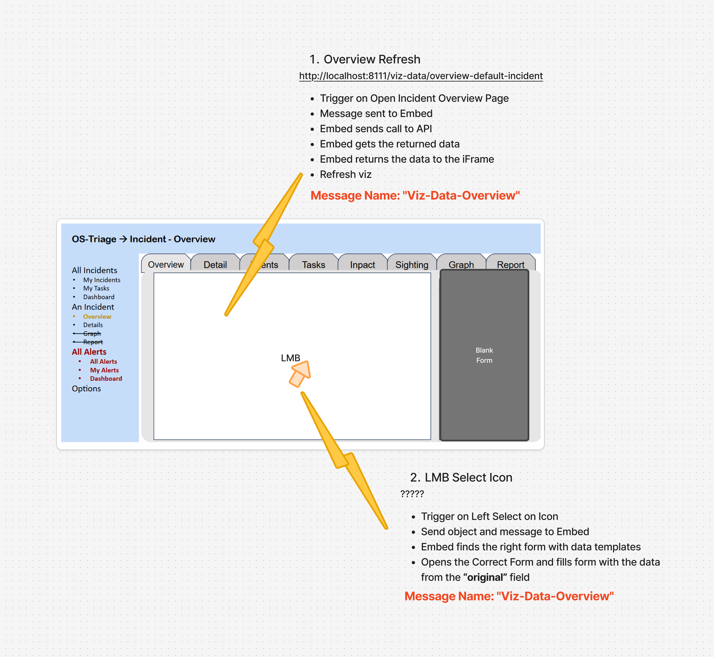

# Page 2: Incident Overview

This simple page, is assembled by standard OS Threat widgets, including: table, buttons etc. However, it also requires an iFrame.

The prototype includes 2 events, which must first be sent as Events from the iFrame to the Embed, which then translates them to an api, see image below.

## Event 1: overview Refresh

## Event 2: LMB Left-Select, Open Form

