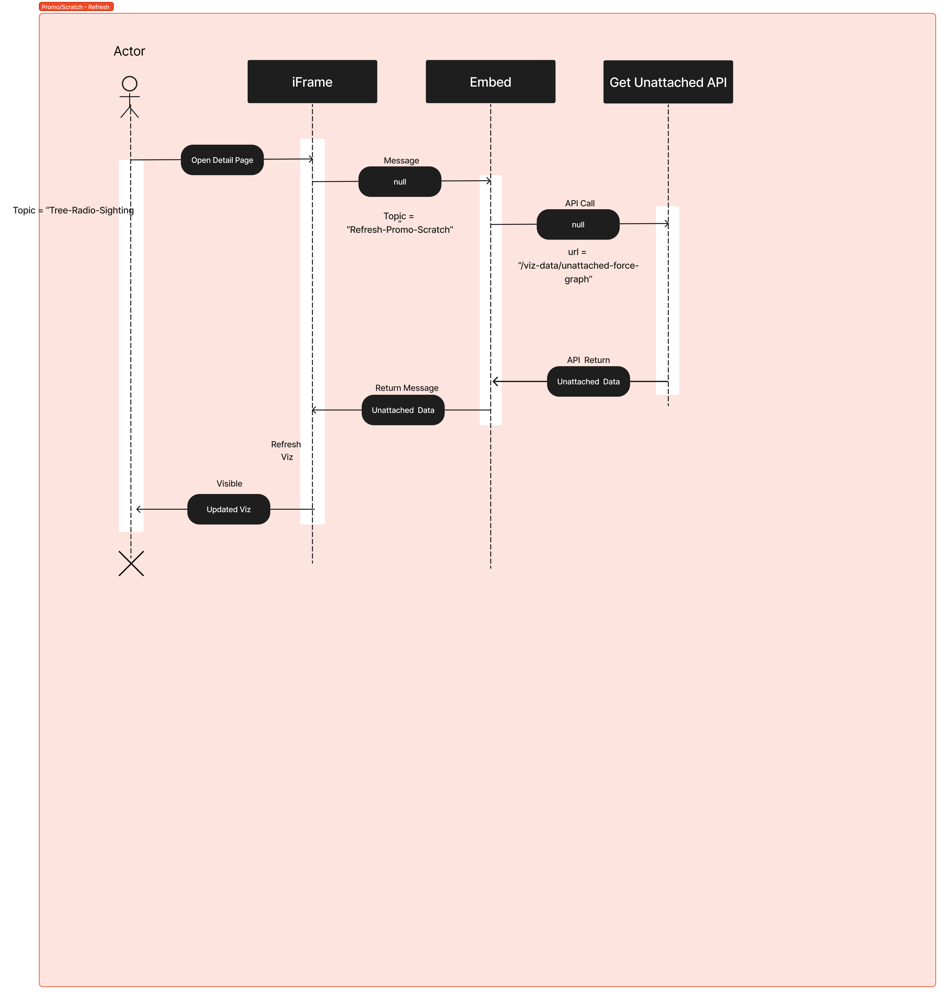
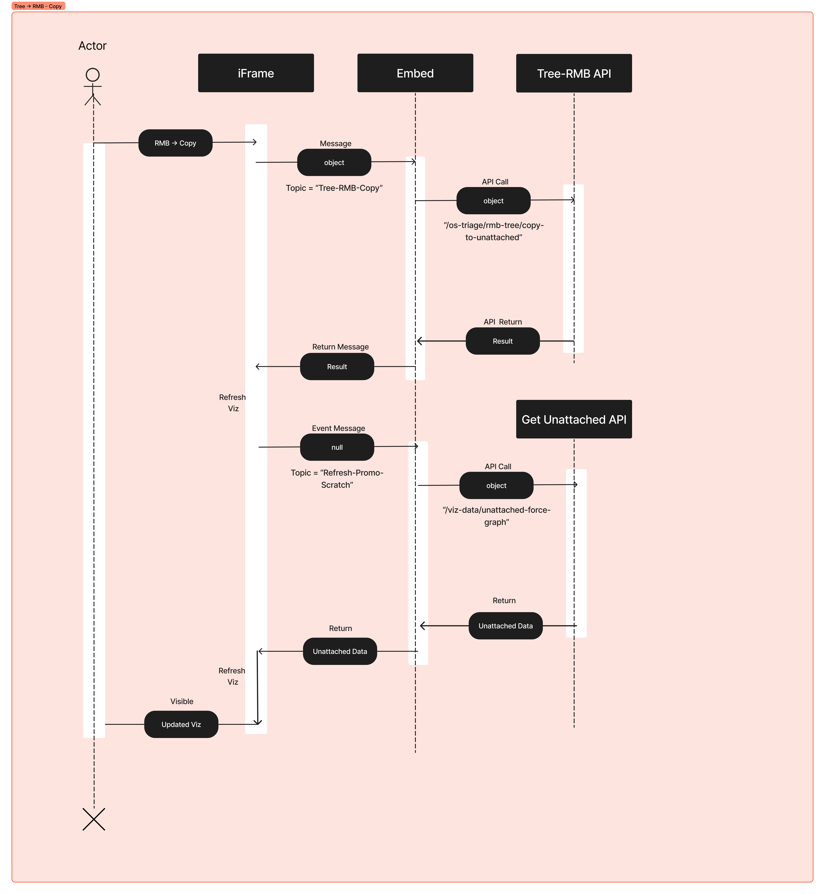

# Page 3: Incident Details

This si the most sophisticatdd view, combining an iFrame with three spearate viz, forms and external buttons

The prototype includes a number of events, which must first be sent as Messages from the iFrame to the Embed, which then translates them to an api, see image below.

## Event 1: Main-Viz-Refresh

## Event 2: Force-LMB Left-Select, Open Form

## Event 3: Force-RMB-Create SRO

## Event 4: Force-RMB-Create Connection

## Event 5: Tree-RMB-Edit DAG

## Event 6: Tree-RMB-Copy

## Event 7: Radio Buttons

