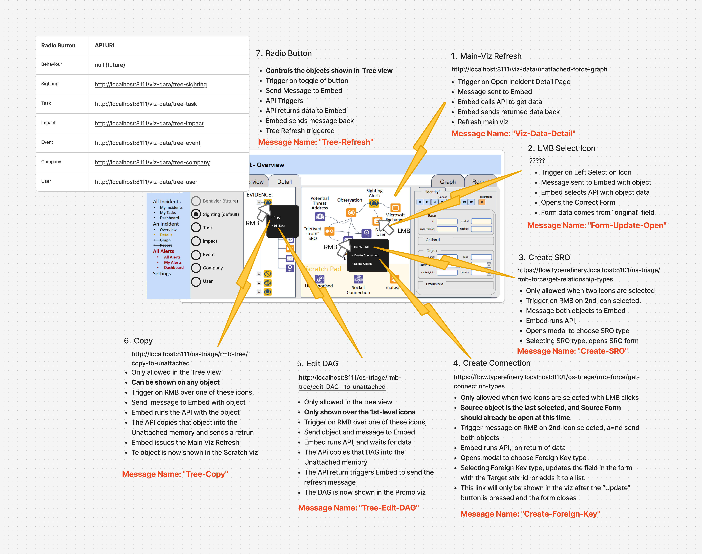

# Page 3: Incident Details

This si the most sophisticatdd view, combining an iFrame with three spearate viz, forms and external buttons

The prototype includes a number of events, which must first be sent as Messages from the iFrame to the Embed, which then translates them to an api, see image below.

## Event 1: Incident Detail Refresh

## Event 2: LMB Left-Select, Open Form

