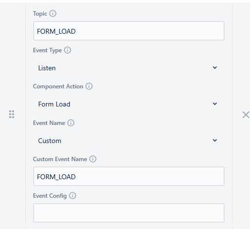
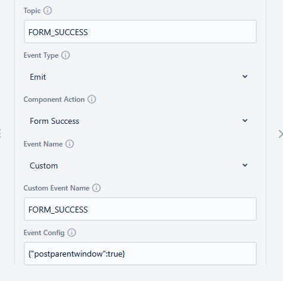
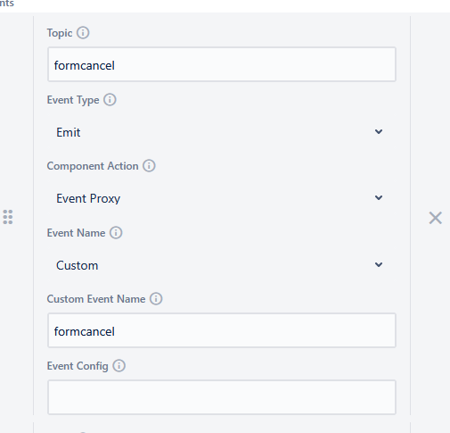
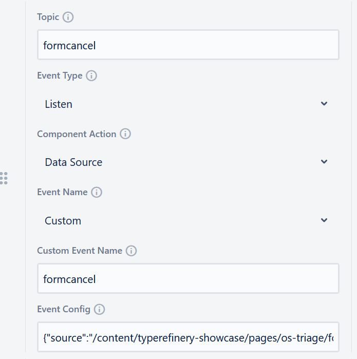
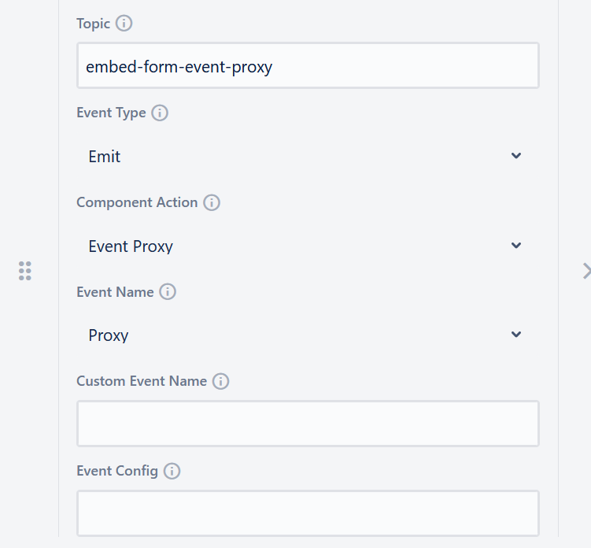
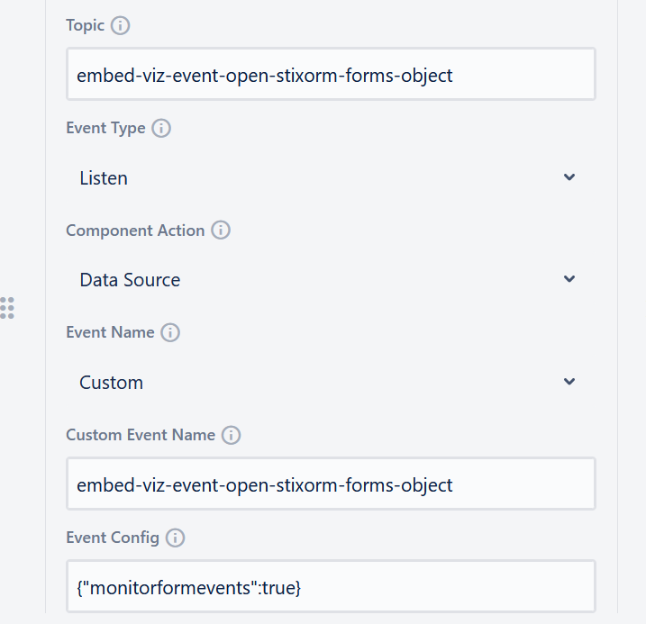

# CMS Events

## 1. Form Events

| Topic | Event Type | Component Action | Event Name | Custom Event Name | Event Config |
|-------|------------|------------------|------------|--------------------|--------------|
| FORM_LOAD | Listen | Form Load | Custom | FORM_LOAD |  |
| FORM_SUCCESS | Emit | Form Success | Custom | FORM_SUCCESS | {"postparentwindow": true} |

## 2. Embed Events

### 2.1 Form Embed Events

| Topic | Event Type | Component Action | Event Name | Custom Event Name | Event Config |
|-------|------------|------------------|------------|--------------------|--------------|
| formcancel | Emit | Event Proxy | Custom | formcancel |  |
| formcancel | Listen | Data Source | Custom | formcancel | {"source":"/content/typerefinery-showcase/pages/os-triage/forms/stixorm-forms/default.html"} |
| embed-form-event-proxy | Emit | Event Proxy | Proxy |  |  |
| embed-viz-event-open-stixorm-forms-sro-forms-relationship-form | Listen | Data Source | Custom | embed-viz-event-open-stixorm-forms-sro-forms-relationship-form | {"monitorformevents":true} |

#### 2.1.1: Form Cancel Emit

When the Embed is opened/initialised, the Form Cancel event is emitted and chained to the Form Cancel listen event, which is also in the Embed.

#### 2.1.2: Form Cancel Listen

The Form Cancel listen event is used to listen for the Form Cancel event from the Embed.

 

#### 2.1.3 Embed Open Form Emit

The Embed Open Form emit event is used to emit the Form Open event to the Embed.

#### 2.1.4 Embed Open Form Listen

The Embed Open Form listen event is used to listen for the Form Open event from the Embed.

## 3. Chart Events